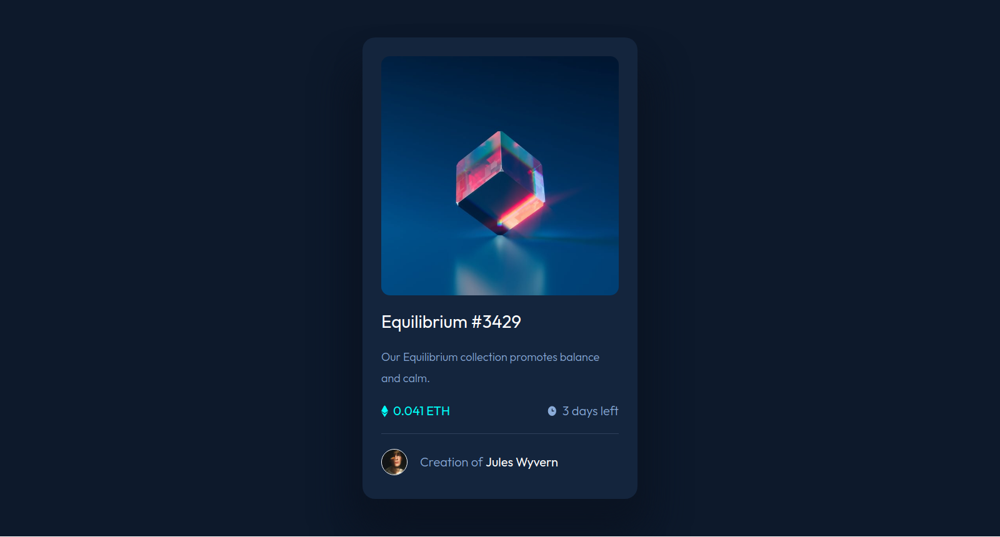

# Frontend Mentor - NFT preview card component solution

This is a solution to the [NFT preview card component challenge on Frontend Mentor](https://www.frontendmentor.io/challenges/nft-preview-card-component-SbdUL_w0U). Frontend Mentor challenges help you improve your coding skills by building realistic projects. 

## Table of contents

- [Overview](#overview)
  - [The challenge](#the-challenge)
  - [Screenshot](#screenshot)
  - [Links](#links)
- [My process](#my-process)
  - [Built with](#built-with)
  - [What I learned](#what-i-learned)
  - [Continued development](#continued-development)
- [Author](#author)

## Overview

### The challenge

Users should be able to:

- View the optimal layout depending on their device's screen size
- See hover states for interactive elements

### Screenshot



### Links

- Solution URL: [https://github.com/kpax10/nft-preview-card](https://your-solution-url.com)
- Live Site URL: [https://kpax10.github.io/nft-preview-card/](https://kpax10.github.io/nft-preview-card/)

## My process

### Built with

- Semantic HTML5 markup
- CSS custom properties
- Flexbox
- CSS Grid

### What I learned

This was my first time attempting a hover effect with an image and color overlay.

```css
.img-container:hover .overlay {
    opacity: 0.5;
    transition: .3s all ease-in-out;
}
```
### Continued development

I would like to better understand the relative vs absolute position relationship in CSS.
The overlay icon has opacity when it shouldn't. This will be fixed as soon as I can find a solution.

## Author

- Website - [https://github.com/kpax10](https://www.your-site.com)
- Frontend Mentor - [https://www.frontendmentor.io/profile/kpax10](https://www.frontendmentor.io/profile/yourusername)

